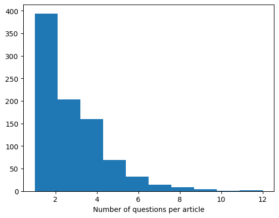
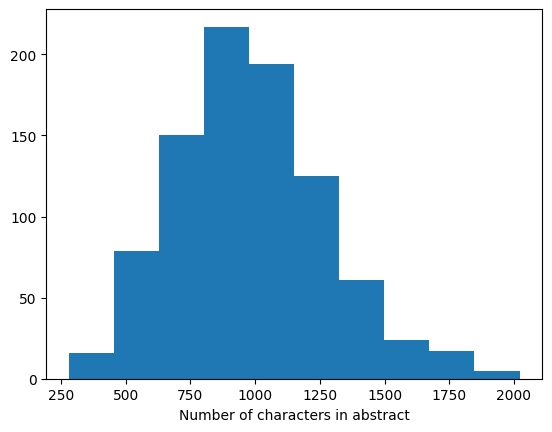
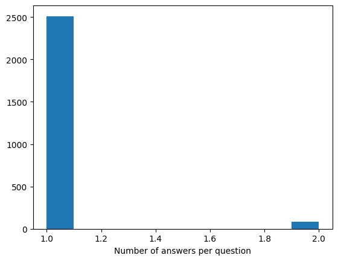
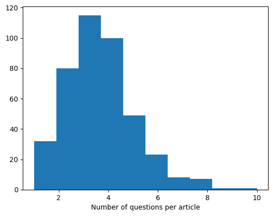
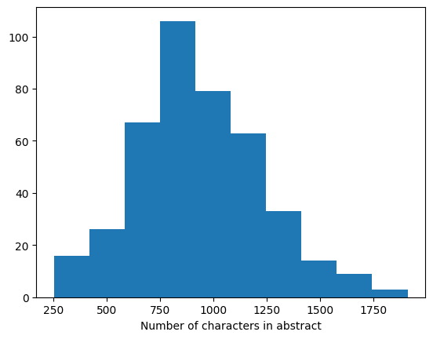
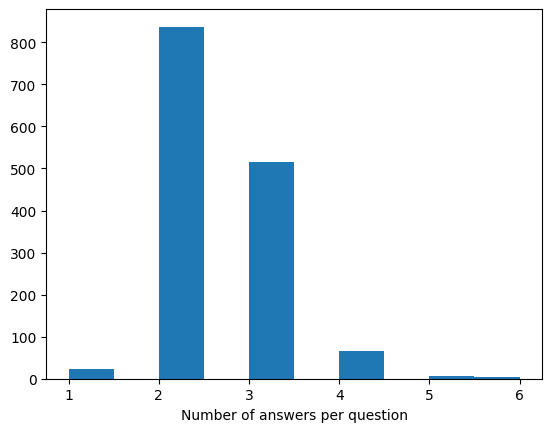

# NLP SoSe 2023 - Assignment 5 - Task 2

## Participants: Kevin Klein, David Kuska, Yorick Scheffer

## Question 2

Training Split:

- Number of Answers:                2675
- Number of Unanswerable Questions: 281
- Number of Free Form Answers:      622
- Number of Extractive Answers:     1363

Distribution Questions per Article:

Distribution Characters per Abstract:

Distribution Answers per Questions:

## Question 3

Test Split:

- Number of Answers:                3554
- Number of Unanswerable Questions: 366
- Number of Free Form Answers:      878
- Number of Extractive Answers:     1817

Distribution Questions per Article:

Distribution Characters per Abstract:

Distribution Answers per Questions:

## Question 6

Yes, unfortunately a lot of the samples have to be truncated. 
From the average lengths of the abstracts this was to be expected.

In the training dataset we observed: 2029 truncated and 54 un-truncated samples
In the test dataset we observed: 1131 truncated and 77 un-truncated samples
In the validation dataset we observed: 224 truncated and 8 un-truncated samples

## Question 10

- Question: For logging, store the train and validation loss values for each step to your Weights & Biases https://wandb.ai/site profile and provide us with these plots. You can simply provide us screenshots of these plots.

## Question 11

- Question: How does your model perform when answering? Does the output make sense? What do you think should be done for improving the prediction?